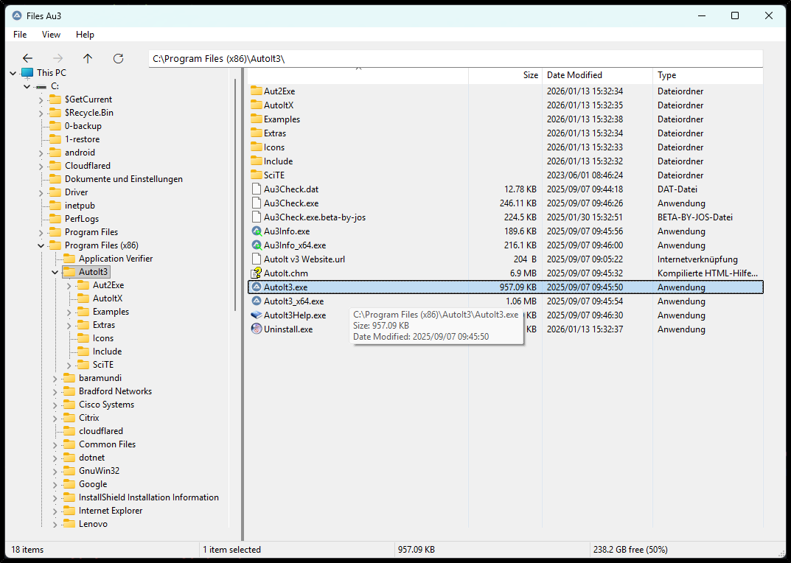
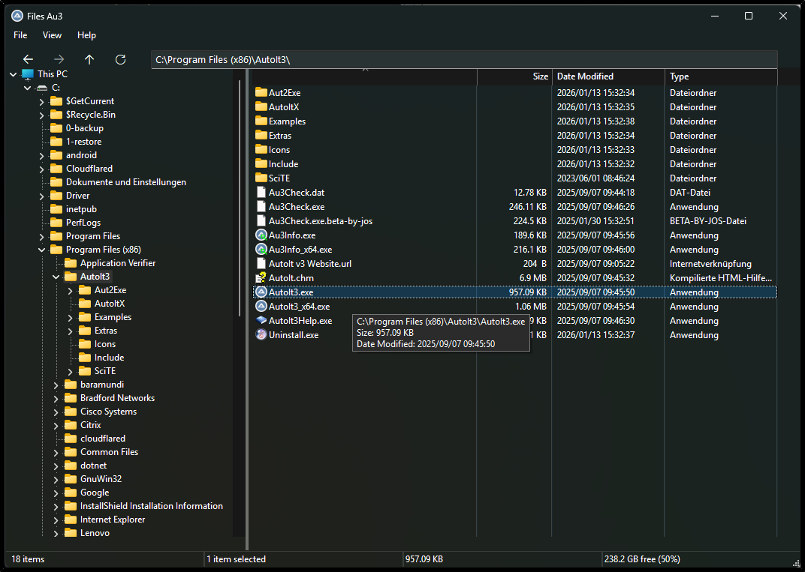

#####

    <!--  -->
    <h2 align="center">Welcome to <code>Files Au3 - AutoIt File Manager</code></h2>

---

[Description](#description) | [Features](#features) | [Roadmap](#roadmap) | [Getting started](#getting-started) | [Configuration](#configuration) | [Contributing](#contributing) | [License](#license) | [Acknowledgements](#acknowledgements)

## Description

A lightweight AutoIt-based file system viewer using TreeListExplorer, focused on collaborative development, extensibility, modern UI behavior, and future growth.

> [!WARNING]
> 1. This repository is in a construction phase and will be enhanced very soon.
> 2. License is not finally settled yet; but almost clarified MIT license is sufficient.

 

## Features

#### *Light and dark mode*

 

#### *Feature B*

To be defined.

#### *Feature C*

To be defined.

 

## Roadmap

> [!NOTE]
> The roadmap shows upcoming features and their current status.

| Feature | Status | Description |
| ---     | ---    | ---         |
| ...     |        |             |
| ...     |        |             |
| ...     |        |             |

 

## Getting started

#### *Preconditions*

To be defined.

#### *Installation*

To be defined.

#### *Usage*

To be defined.

 

## Configuration

To be defined.

 

## Contributing

Any kind of contribution is very welcome and highly appreciated 💛 . 
Please see the [CONTRIBUTING.md](./.github/CONTRIBUTING.md) file for detailed information.

 

## License

Distributed under the MIT License. 
See license details [here](./LICENSE.md) for more information.

Copyright (c) 2026 AutoIt-Community. 
Contact person Sven Seyfert ([@sven-seyfert](https://github.com/sven-seyfert)). 
Repository maintainer [@WildByDesign](https://github.com/WildByDesign).

 

## Acknowledgements

#### *Thanks to the providers*

- Opportunity by [GitHub](https://github.com)
- Badges by [Shields](https://shields.io)
- Contributor images by [Contrib.rocks](https://contrib.rocks)

#### *Thanks to the third-party authors*

| Author                                       | Field                                          |
| ---                                          | ---                                            |
| @ahmet                                       | Non-client painting of white line in dark mode |
| [@argumentum](https://github.com/abrupto)    | Dark Mode functions                            |
| @DK12000                                     | Dark Mode functions                            |
| [@DonChunior](https://github.com/DonChunior) | Code review, bug fixes and refactoring         |
| [@ioa747](https://github.com/ioa747)         | Detached Header subclassing for dark mode      |
| [@Kanashius](https://github.com/kanashius)   | TreeListExplorer UDF                           |
| @Kip                                         | GUIFrame UDF                                   |
| @line333                                     | WinAPI functions                               |
| @Melba23                                     | GUIFrame UDF                                   |
| @Nine                                        | Custom Draw for Buttons                        |
| @NoNameCode                                  | Dark Mode functions                            |
| @pixelsearch                                 | Detached Header and ListView synchronization   |
| @Rasim                                       | GUI Control function                           |
| @UEZ                                         | Lots and lots and lots                         |

#### *Thanks to the contributors*

Made with [contrib.rocks](https://stg.contrib.rocks/preview?repo=AutoIt-Community%2Ffiles-au3).

##

[To the top](#)
